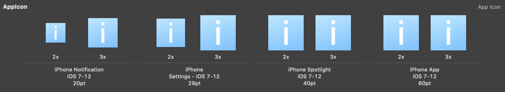
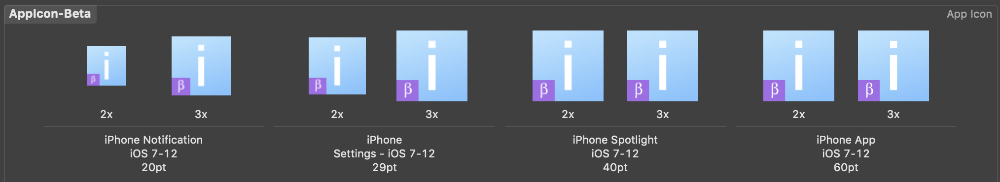
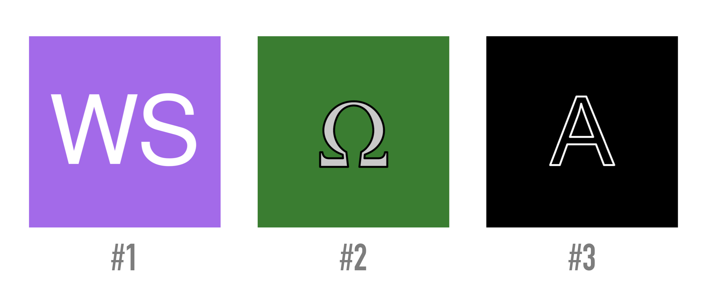

iOS Icon Generator
============

[](https://app.bitrise.io/app/b23ec2cde834230f)
[](https://fueled.github.io/ios-icon-generator/)
[](http://www.apache.org/licenses/LICENSE-2.0)

## Usage

The CLI currently supports 2 commands:

- `generate`: generates an iOS App Icon Set from a base PDF
- `mask`: generates a new iOS App Icon Sets from a base one, adding a mask at its bottom left which can be customized.
- `stub`: generates a default iOS App Icon Sets, using a background color, a text and its color.

### Installation

iOS Icon Generator is built using Ruby, and can be installed using its default local installation in your terminal via:

```bash
sudo gem install ios_icon_generator
```

If you wish not to use `sudo` permissions to RubyGems, you can follow the instructions of the `CocoaPods` guys [here](https://guides.cocoapods.org/using/getting-started.html#getting-started), by replacing all `cocoapods` with `ios_icon_generator` in the shell commands.

### Generate App Icon Sets

For now, the CLI supports generating app icon sets for all supported platforms:

- iPhone
- iPad
- Apple Watch
- Mac
- Carplay

> Please note that the Display P3 color space is not supported yet

And supports generating sticker packs icons for iMessage apps.

You can specify iPhone and iPad at the same time, however iMessage must be specified on its own.

The base syntax of the command is:

```bash
icongen generate <PDF Base Icon> [XCAsset Folder] --type=<type>
```

If the `XCAsset Folder` is not specified, then the current working is assumed to be the output folder.
The type, if not specified, defaults to `iphone`.

For example, to generate icons for iPhones and iPads, and output the images set in `Images.xcassets`, run (assuming the path Icon PDF file is also in the current directory and is called `Icon.pdf`):
```bash
icongen generate Icon.pdf Images.xcassets --type=iphone,ipad
```

There are more options to `icongen generate` which you can discover by running `icongen generate --help`.

### Masking Existing App Icon Sets

The application also supports "masking" app icons, adding a small mask at the bottom-left corner of the icons, allowing for example to convert the following icons:

Into this:


The command used in the example was (it assumes that `AppIcon.appiconset` is the original App Icon Set and is in the current working directory):
```bash
icongen mask AppIcon.appiconset \
    --mask-shape=square \
    --x-size-ratio=0.30 \
    --y-size-ratio=0.30 \
    --size-offset=0.11 \
    --x-offset=0.1 \
    --y-offset=0.1 \
    --background-color='#A36AE9' \
    --stroke-width-offset=0 \
    --font=Symbol \
    --symbol-color='#FFFFFF'
```

For now, the command only supports adding a mask into the bottom-left corner, but allowing to add it anywhere is definitely a feature we want.

The command supports a lot of customization through options, and you can find more information about each option by typing `icongen mask --help`

### Creating temporary icons

The application also supports creating "temporary" icons, that you would use during development if you don't have an icon yet (for example at project creation). For example, here are some icons created using various commands:



Here's the command that were run to get each icons above:
```bash
#1
icongen stub \
    WS \
    --background-color='#A36AE9' \
    --stroke-width-offset=0 \
    --y-offset=-0.04 \
    --size-offset=0.5 \
    --symbol-color='#FFFFFF'
```
```bash
#2
icongen stub \
    W \
    --background-color='#3A7D31' \
    --font=Symbol \
    --stroke-width-offset=0.01 \
    --y-offset=-0.07 \
    --size-offset=0.5 \
    --symbol-color='#C9C9C9'
```
```bash
#3
icongen stub \
    A \
    --background-color='#000000' \
    --stroke-width-offset=0.01 \
    --stroke-color='#FFFFFF' \
    --font='Arial' \
    --size-offset=0.5 \
    --symbol-color='#000000'
```

The command supports a lot of customization through options, and you can find more information about each option by typing `icongen stub --help`.

## Development

### Set Up

To set you up for developing on driveshaft, first make sure the repository is cloned and you're in its root folder, and then run the following:

```bash
echo "BUNDLE_GEMFILE=\"`pwd`/Gemfile\" bundler exec ruby \"`pwd`/bin/icongen\" \"\${@---help}\"" > /usr/local/bin/icongen-dev
chmod +x /usr/local/bin/icongen-dev
```

All you'll be all set!
To run the development version of `icongen` from anywhere, just run `icongen-dev` rather than `icongen`.  
You can then proceed on developing locally on the ios-icon-generator repository, and create a PR whenever a new piece of code is ready to be reviewed and integrated!

To run the test suite, you may run the following command from the root folder:
```bash
bundler exec ruby bin/rspec -I .
```
